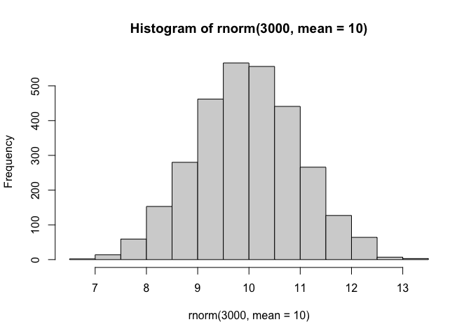
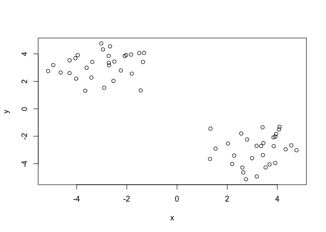
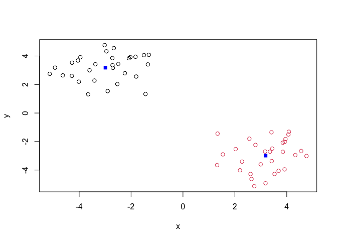
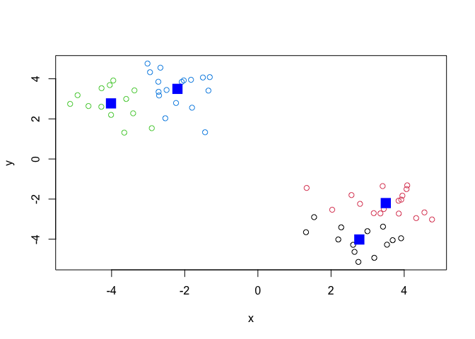
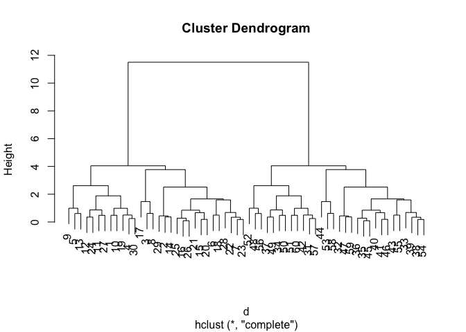
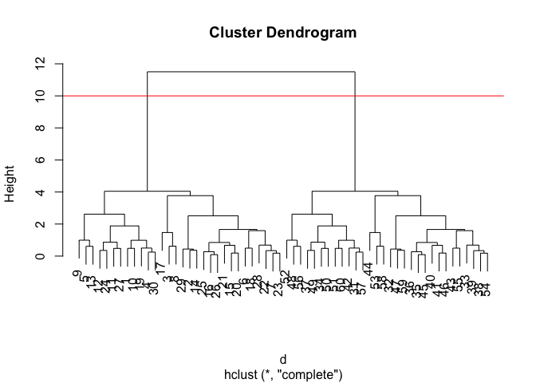
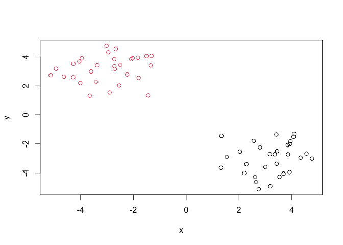
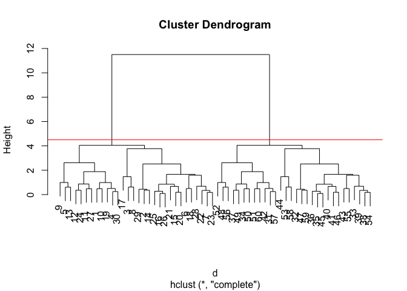
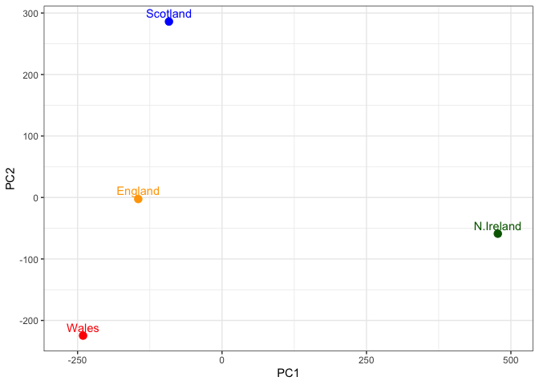

# Class 7: Machine Learning 1
Dariana Becerra Guzman (A17506182)

- [Background](#background)
- [K-means clustering](#k-means-clustering)
- [Hierarchical Clustering](#hierarchical-clustering)
- [Principal Component Analysis
  (PCA)](#principal-component-analysis-pca)
  - [PCA of UK Food Data](#pca-of-uk-food-data)
- [Heatmap](#heatmap)
- [PCA to the rescue](#pca-to-the-rescue)
- [Digging deeper (variable
  loadings)](#digging-deeper-variable-loadings)

## Background

Today we will begin our exploration of important machine learning
methids with a focus on **clustering** and **dimensionallity
reduction**.

To start testing these methods let’s make uo some sample data to cluster
where we know what the answer should be.

``` r
hist(rnorm(3000, mean = 10))
```



> Q. Can you generate 30 numbers centered at +3 and 30 numbers at -3
> taken at random from a normal distribution?

``` r
tmp <- c(rnorm(30, mean = 3), 
         rnorm(30, mean = -3) )

x <- cbind(x=tmp, y=rev(tmp))
```

``` r
plot(x)
```



## K-means clustering

The main function in “base R” for K-means clustering is called
`kmeans()`, let’s try it out:

``` r
k <- kmeans(x, centers = 2)
k
```

    K-means clustering with 2 clusters of sizes 30, 30

    Cluster means:
              x         y
    1 -2.986562  3.182925
    2  3.182925 -2.986562

    Clustering vector:
     [1] 2 2 2 2 2 2 2 2 2 2 2 2 2 2 2 2 2 2 2 2 2 2 2 2 2 2 2 2 2 2 1 1 1 1 1 1 1 1
    [39] 1 1 1 1 1 1 1 1 1 1 1 1 1 1 1 1 1 1 1 1 1 1

    Within cluster sum of squares by cluster:
    [1] 59.09789 59.09789
     (between_SS / total_SS =  90.6 %)

    Available components:

    [1] "cluster"      "centers"      "totss"        "withinss"     "tot.withinss"
    [6] "betweenss"    "size"         "iter"         "ifault"      

> Q. What component of your kmeans result object had the cluster
> centers?

``` r
k$centers
```

              x         y
    1 -2.986562  3.182925
    2  3.182925 -2.986562

> Q. What component of your kmeans result has the cluster size?

``` r
k$size
```

    [1] 30 30

> Q. What component of your kmeans result object has the cluster
> membership vector (i.e. the mean clustering result: which points are
> in which cluster)?

``` r
k$cluster
```

     [1] 2 2 2 2 2 2 2 2 2 2 2 2 2 2 2 2 2 2 2 2 2 2 2 2 2 2 2 2 2 2 1 1 1 1 1 1 1 1
    [39] 1 1 1 1 1 1 1 1 1 1 1 1 1 1 1 1 1 1 1 1 1 1

> Q. Plot the results of clustering (i.e. our dara colored by the
> clustering result) along with the cluster centers?

``` r
plot(x, col = k$cluster)
points(k$centers, col="blue", pch=15)
```



> Q. Can you run `kmeans()` again and cluster `x` into 4 clusters and
> plot the results just like we did above with coloring by cluster and
> the cluster cetners shown in blue/

``` r
k4 <- kmeans(x, centers = 4)
plot(x, col=k4$cluster)
points(k4$centers, col="blue", pch=15, cex=2)
```



> **Key-point:** Kmeans will always retunr the clustering that we ask
> for (this is the “K” or “centers” in K-means)!

``` r
k$tot.withinss
```

    [1] 118.1958

## Hierarchical Clustering

The main function for hierarchiacal clustering in base R is called
`hclust()`.

One of the main differences with respect to the `kmeans()` function is
that you can not just pass your input data directly to `hclust()` - it
needs a “distance matrix” as input. We can get this from lots of place
including the `dist()` function.

``` r
d <- dist(x)
hc <- hclust(d)
plot(hc)
```



We can “cut” the dendrogram or “tree” at a given height to yield our
“cluters”. For this we use the function `cutree()`.

``` r
plot(hc)
abline(h=10, col="red")
```



``` r
grps <- cutree(hc, h=10)
```

``` r
grps
```

     [1] 1 1 1 1 1 1 1 1 1 1 1 1 1 1 1 1 1 1 1 1 1 1 1 1 1 1 1 1 1 1 2 2 2 2 2 2 2 2
    [39] 2 2 2 2 2 2 2 2 2 2 2 2 2 2 2 2 2 2 2 2 2 2

> Q. Plot our data `x` colored by the clustering result from `hclust()`
> and `cutree()`?

``` r
grps <- cutree(hc, h=10)
plot(x, col=grps)
```



``` r
plot(hc)
abline(h=4.5, col="red")
```



``` r
grps <- cutree(hc, h=4.5)
```

## Principal Component Analysis (PCA)

PCA is a popular dimensionality reduction technique that is widely used
in bioinformatics.

### PCA of UK Food Data

> Q1. How many rows and columns are in your new data frame named x? What
> R functions could you use to answer this questions?

``` r
dim(x)
```

    [1] 60  2

``` r
url <- "https://tinyurl.com/UK-foods"
x <- read.csv(url)
dim(x); ncol(x); nrow(x)
```

    [1] 17  5

    [1] 5

    [1] 17

``` r
rownames(x) <- x[,1]
x <- x[,-1]
head(x)
```

                   England Wales Scotland N.Ireland
    Cheese             105   103      103        66
    Carcass_meat       245   227      242       267
    Other_meat         685   803      750       586
    Fish               147   160      122        93
    Fats_and_oils      193   235      184       209
    Sugars             156   175      147       139

> Q2. Which approach to solving the ‘row-names problem’ mentioned above
> do you prefer and why? Is one approach more robust than another under
> certain circumstances?

I prefer the second approach to solving the ‘row-names problem’ because
it is much more straight forward and less confusing. I think the second
approach is more robust than the first.

``` r
x <- read.csv(url, row.names=1)
head(x)
```

                   England Wales Scotland N.Ireland
    Cheese             105   103      103        66
    Carcass_meat       245   227      242       267
    Other_meat         685   803      750       586
    Fish               147   160      122        93
    Fats_and_oils      193   235      184       209
    Sugars             156   175      147       139

``` r
barplot(as.matrix(x), beside=T, col=rainbow(nrow(x)))
```


> Q3: Changing what optional argument in the above barplot() function
> results in the following plot?

Changing beside = T to beside = F.

``` r
library(tidyr)
```

``` r
# Convert data to long format for ggplot with `pivot_longer()`
x_long <- x |> 
          tibble::rownames_to_column("Food") |> 
          pivot_longer(cols = -Food, 
                       names_to = "Country", 
                       values_to = "Consumption")

dim(x_long)
```

    [1] 68  3

``` r
library(ggplot2)

ggplot(x_long) +
  aes(x = Country, y = Consumption, fill = Food) +
  geom_col(position = "dodge") +
  theme_bw()
```


> Q4: Changing what optional argument in the above ggplot() code results
> in a stacked barplot figure?

changing geom_col(position=“stack”)

``` r
pairs(x, col=rainbow(nrow(x)), pch=16)
```


> Q5: We can use the `pairs()` function to generate all pairwise plots
> for our countries. Can you make sense of the following code and
> resulting figure? What does it mean if a given point lies on the
> diagonal for a given plot?

It plots every country against each other. The diagonal would be the
same country against itself (e.x. England vs England), they would be the
same.

``` r
library(pheatmap)
pheatmap( as.matrix(x) )
```


> Q6. Based on the pairs and heatmap figures, which countries cluster
> together and what does this suggest about their food consumption
> patterns? Can you easily tell what the main differences between N.
> Ireland and the other countries of the UK in terms of this data-set?

Based on the colors we are able to tell that N.Ireland/Scotland and
England/Wales cluster together. This suggests that their food
consumption patterns are similar to one another. In terms of this data
set, it is quite difficult to easily tell the main differences between
N.Ireland and the other countries of the UK.

## Heatmap

We can install the **pheatmap** package with the `install.packages()`
command that we used previously. Remember that we always run this in the
console and not code chunk in our quarto document.

Of all these plots really only the `pairs()` plot was useful. This
however took a bit of work to interpret and will to scale when I am
looking at much bigger datasets.

## PCA to the rescue

The main function in “base R” for PCA called `prcomp()`.

``` r
pca <- prcomp( t(x) )
summary(pca)
```

    Importance of components:
                                PC1      PC2      PC3     PC4
    Standard deviation     324.1502 212.7478 73.87622 2.7e-14
    Proportion of Variance   0.6744   0.2905  0.03503 0.0e+00
    Cumulative Proportion    0.6744   0.9650  1.00000 1.0e+00

> Q. How much varance is captured in the first PC?

67.4%

> Q. How many PCs do I need to capture at least 90% of the total varance
> in the dataset?

Two PCs capture 96.5%

> Q. Plot our main PCA result. Folks can call this different things
> depending on their field of study. (i.e. “PC plot”, “score plot”, “PC1
> vs PC2 plot”, …)

> Q7. Complete the code below to generate a plot of PC1 vs PC2. The
> second line adds text labels over the data points.

``` r
# Create a data frame for plotting
df <- as.data.frame(pca$x)
df$Country <- rownames(df)

# Plot PC1 vs PC2 with ggplot
ggplot(pca$x) +
  aes(x = PC1, y = PC2, label = rownames(pca$x)) +
  geom_point(size = 3) +
  geom_text(vjust = -0.5) +
  xlim(-270, 500) +
  xlab("PC1") +
  ylab("PC2") +
  theme_bw()
```


> Q8. Customize your plot so that the colors of the country names match
> the colors in our UK and Ireland map and table at start of this
> document.

``` r
# Create a data frame for plotting
df <- as.data.frame(pca$x)
df$Country <- rownames(df)

# Plot PC1 vs PC2 with ggplot
my_cols <- c("orange", "red", "blue", "darkgreen")

ggplot(pca$x) +
  aes(x = PC1, y = PC2, label = rownames(pca$x) ) +
  geom_point(size = 3, color = my_cols) +
  geom_text(vjust = -0.5, color = my_cols) +
  xlim(-270, 500) +
  xlab("PC1") +
  ylab("PC2") +
  theme_bw()
```



## Digging deeper (variable loadings)

How do the original variables (i.e. the 17 different foods) contribute
to our new PCs?

``` r
v <- round( pca$sdev^2/sum(pca$sdev^2) * 100 )
v
```

    [1] 67 29  4  0

``` r
z <- summary(pca)
z$importance
```

                                 PC1       PC2      PC3          PC4
    Standard deviation     324.15019 212.74780 73.87622 2.699876e-14
    Proportion of Variance   0.67444   0.29052  0.03503 0.000000e+00
    Cumulative Proportion    0.67444   0.96497  1.00000 1.000000e+00

``` r
# Create scree plot with ggplot
variance_df <- data.frame(
  PC = factor(paste0("PC", 1:length(v)), levels = paste0("PC", 1:length(v))),
  Variance = v
)

ggplot(variance_df) +
  aes(x = PC, y = Variance) +
  geom_col(fill = "steelblue") +
  xlab("Principal Component") +
  ylab("Percent Variation") +
  theme_bw() +
  theme(axis.text.x = element_text(angle = 0))
```


``` r
## Lets focus on PC1 as it accounts for > 90% of variance 
ggplot(pca$rotation) +
  aes(x = PC1, 
      y = reorder(rownames(pca$rotation), PC1)) +
  geom_col(fill = "steelblue") +
  xlab("PC1 Loading Score") +
  ylab("") +
  theme_bw() +
  theme(axis.text.y = element_text(size = 9))
```


