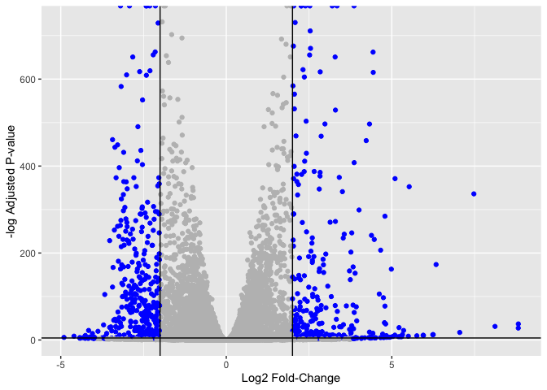

# Class 14: RNA-Seq analysis mini-project
Dariana Becerra Guzman (A17506182)

- [Background](#background)
- [Data Import](#data-import)
  - [Check and Tidy](#check-and-tidy)
- [Setup for DESeq](#setup-for-deseq)
- [Remove zero count genes](#remove-zero-count-genes)
  - [Run DESeq](#run-deseq)
  - [Get results](#get-results)
  - [Save results](#save-results)
- [Volcano Plot](#volcano-plot)
- [Add gene annotation](#add-gene-annotation)
  - [MapIds](#mapids)
  - [Save annotated results](#save-annotated-results)
- [Pathway analysis](#pathway-analysis)
- [GO analysis](#go-analysis)
- [Reactome Analysis](#reactome-analysis)

## Background

> Trapnell C, Hendrickson DG, Sauvageau M, Goff L et al. “Differential
> analysis of gene regulation at transcript resolution with RNA-seq”.

The authors report on differential analysis of lung fibroblasts in
response to loss of the developmental transcription factor HOXA1.

## Data Import

We have 2 key input files: counts and metadata.

``` r
library(DESeq2)
```

    Loading required package: S4Vectors

    Loading required package: stats4

    Loading required package: BiocGenerics

    Loading required package: generics


    Attaching package: 'generics'

    The following objects are masked from 'package:base':

        as.difftime, as.factor, as.ordered, intersect, is.element, setdiff,
        setequal, union


    Attaching package: 'BiocGenerics'

    The following objects are masked from 'package:stats':

        IQR, mad, sd, var, xtabs

    The following objects are masked from 'package:base':

        anyDuplicated, aperm, append, as.data.frame, basename, cbind,
        colnames, dirname, do.call, duplicated, eval, evalq, Filter, Find,
        get, grep, grepl, is.unsorted, lapply, Map, mapply, match, mget,
        order, paste, pmax, pmax.int, pmin, pmin.int, Position, rank,
        rbind, Reduce, rownames, sapply, saveRDS, table, tapply, unique,
        unsplit, which.max, which.min


    Attaching package: 'S4Vectors'

    The following object is masked from 'package:utils':

        findMatches

    The following objects are masked from 'package:base':

        expand.grid, I, unname

    Loading required package: IRanges

    Loading required package: GenomicRanges

    Loading required package: Seqinfo

    Loading required package: SummarizedExperiment

    Loading required package: MatrixGenerics

    Loading required package: matrixStats


    Attaching package: 'MatrixGenerics'

    The following objects are masked from 'package:matrixStats':

        colAlls, colAnyNAs, colAnys, colAvgsPerRowSet, colCollapse,
        colCounts, colCummaxs, colCummins, colCumprods, colCumsums,
        colDiffs, colIQRDiffs, colIQRs, colLogSumExps, colMadDiffs,
        colMads, colMaxs, colMeans2, colMedians, colMins, colOrderStats,
        colProds, colQuantiles, colRanges, colRanks, colSdDiffs, colSds,
        colSums2, colTabulates, colVarDiffs, colVars, colWeightedMads,
        colWeightedMeans, colWeightedMedians, colWeightedSds,
        colWeightedVars, rowAlls, rowAnyNAs, rowAnys, rowAvgsPerColSet,
        rowCollapse, rowCounts, rowCummaxs, rowCummins, rowCumprods,
        rowCumsums, rowDiffs, rowIQRDiffs, rowIQRs, rowLogSumExps,
        rowMadDiffs, rowMads, rowMaxs, rowMeans2, rowMedians, rowMins,
        rowOrderStats, rowProds, rowQuantiles, rowRanges, rowRanks,
        rowSdDiffs, rowSds, rowSums2, rowTabulates, rowVarDiffs, rowVars,
        rowWeightedMads, rowWeightedMeans, rowWeightedMedians,
        rowWeightedSds, rowWeightedVars

    Loading required package: Biobase

    Welcome to Bioconductor

        Vignettes contain introductory material; view with
        'browseVignettes()'. To cite Bioconductor, see
        'citation("Biobase")', and for packages 'citation("pkgname")'.


    Attaching package: 'Biobase'

    The following object is masked from 'package:MatrixGenerics':

        rowMedians

    The following objects are masked from 'package:matrixStats':

        anyMissing, rowMedians

``` r
metaFile <- "GSE37704_metadata.csv"
countFile <- "GSE37704_featurecounts.csv"
```

### Check and Tidy

``` r
# Import metadata and take a peek
colData <- read.csv(metaFile, row.names=1)
head(colData)
```

                  condition
    SRR493366 control_sirna
    SRR493367 control_sirna
    SRR493368 control_sirna
    SRR493369      hoxa1_kd
    SRR493370      hoxa1_kd
    SRR493371      hoxa1_kd

``` r
# Import countdata
countData <-read.csv(countFile, row.names=1)
head(countData)
```

                    length SRR493366 SRR493367 SRR493368 SRR493369 SRR493370
    ENSG00000186092    918         0         0         0         0         0
    ENSG00000279928    718         0         0         0         0         0
    ENSG00000279457   1982        23        28        29        29        28
    ENSG00000278566    939         0         0         0         0         0
    ENSG00000273547    939         0         0         0         0         0
    ENSG00000187634   3214       124       123       205       207       212
                    SRR493371
    ENSG00000186092         0
    ENSG00000279928         0
    ENSG00000279457        46
    ENSG00000278566         0
    ENSG00000273547         0
    ENSG00000187634       258

> Q. Complete the code below to remove the troublesome first column from
> countData.

We need to remove the first “length” column from `countData` to have a
1:1 correspondance with `colData` rows.

``` r
countData <- as.matrix(countData[,-1])
head(countData)
```

                    SRR493366 SRR493367 SRR493368 SRR493369 SRR493370 SRR493371
    ENSG00000186092         0         0         0         0         0         0
    ENSG00000279928         0         0         0         0         0         0
    ENSG00000279457        23        28        29        29        28        46
    ENSG00000278566         0         0         0         0         0         0
    ENSG00000273547         0         0         0         0         0         0
    ENSG00000187634       124       123       205       207       212       258

## Setup for DESeq

> Q. Complete the code below to filter countData to exclude genes
> (i.e. rows) where we have 0 read count across all samples
> (i.e. columns).

``` r
dds <- DESeqDataSetFromMatrix(countData = countData, 
                       colData = colData,
                       design = ~condition)
```

    Warning in DESeqDataSet(se, design = design, ignoreRank): some variables in
    design formula are characters, converting to factors

``` r
head(dds)
```

    class: DESeqDataSet 
    dim: 6 6 
    metadata(1): version
    assays(1): counts
    rownames(6): ENSG00000186092 ENSG00000279928 ... ENSG00000273547
      ENSG00000187634
    rowData names(0):
    colnames(6): SRR493366 SRR493367 ... SRR493370 SRR493371
    colData names(1): condition

## Remove zero count genes

Some genes (rows) have no count data (i.e. zero values). We should
remove these before any further analysis.

``` r
rownames(colData) == colnames(countData)
```

    [1] TRUE TRUE TRUE TRUE TRUE TRUE

### Run DESeq

``` r
dds
```

    class: DESeqDataSet 
    dim: 19808 6 
    metadata(1): version
    assays(1): counts
    rownames(19808): ENSG00000186092 ENSG00000279928 ... ENSG00000277475
      ENSG00000268674
    rowData names(0):
    colnames(6): SRR493366 SRR493367 ... SRR493370 SRR493371
    colData names(1): condition

### Get results

``` r
dds = DESeq(dds)
```

    estimating size factors

    estimating dispersions

    gene-wise dispersion estimates

    mean-dispersion relationship

    final dispersion estimates

    fitting model and testing

``` r
res <- results(dds)
head(res)
```

    log2 fold change (MLE): condition hoxa1 kd vs control sirna 
    Wald test p-value: condition hoxa1 kd vs control sirna 
    DataFrame with 6 rows and 6 columns
                     baseMean log2FoldChange     lfcSE      stat     pvalue
                    <numeric>      <numeric> <numeric> <numeric>  <numeric>
    ENSG00000186092    0.0000             NA        NA        NA         NA
    ENSG00000279928    0.0000             NA        NA        NA         NA
    ENSG00000279457   29.9136       0.179257  0.324822  0.551863 0.58104205
    ENSG00000278566    0.0000             NA        NA        NA         NA
    ENSG00000273547    0.0000             NA        NA        NA         NA
    ENSG00000187634  183.2296       0.426457  0.140266  3.040350 0.00236304
                          padj
                     <numeric>
    ENSG00000186092         NA
    ENSG00000279928         NA
    ENSG00000279457 0.68707978
    ENSG00000278566         NA
    ENSG00000273547         NA
    ENSG00000187634 0.00516278

### Save results

``` r
write.csv(res, file="results.csv")
```

## Volcano Plot

``` r
library(ggplot2)

mycols <- rep("gray", nrow(res))
mycols[res$log2FoldChange > 2] <- "blue"
mycols[res$log2FoldChange < -2] <- "blue"
mycols[res$padj >= 0.05 ] <- "gray"

ggplot(res) +
  aes(log2FoldChange, 
      -log(padj)) +
 geom_point(color=mycols) +
labs(x="Log2 Fold-Change", y="-log Adjusted P-value") +
geom_vline(xintercept = c(-2,2)) +
geom_hline(yintercept = -log(0.01))
```

    Warning: Removed 5054 rows containing missing values or values outside the scale range
    (`geom_point()`).



## Add gene annotation

``` r
library("AnnotationDbi")
library("org.Hs.eg.db")
```

``` r
columns(org.Hs.eg.db)
```

     [1] "ACCNUM"       "ALIAS"        "ENSEMBL"      "ENSEMBLPROT"  "ENSEMBLTRANS"
     [6] "ENTREZID"     "ENZYME"       "EVIDENCE"     "EVIDENCEALL"  "GENENAME"    
    [11] "GENETYPE"     "GO"           "GOALL"        "IPI"          "MAP"         
    [16] "OMIM"         "ONTOLOGY"     "ONTOLOGYALL"  "PATH"         "PFAM"        
    [21] "PMID"         "PROSITE"      "REFSEQ"       "SYMBOL"       "UCSCKG"      
    [26] "UNIPROT"     

### MapIds

``` r
columns(org.Hs.eg.db)
```

     [1] "ACCNUM"       "ALIAS"        "ENSEMBL"      "ENSEMBLPROT"  "ENSEMBLTRANS"
     [6] "ENTREZID"     "ENZYME"       "EVIDENCE"     "EVIDENCEALL"  "GENENAME"    
    [11] "GENETYPE"     "GO"           "GOALL"        "IPI"          "MAP"         
    [16] "OMIM"         "ONTOLOGY"     "ONTOLOGYALL"  "PATH"         "PFAM"        
    [21] "PMID"         "PROSITE"      "REFSEQ"       "SYMBOL"       "UCSCKG"      
    [26] "UNIPROT"     

``` r
res$symbol = mapIds(org.Hs.eg.db,
                    keys=row.names(res), 
                    keytype="ENSEMBL",
                    column="SYMBOL")
```

    'select()' returned 1:many mapping between keys and columns

``` r
res$entrez = mapIds(org.Hs.eg.db,
                    keys=row.names(res),
                    keytype="ENSEMBL",
                    column="ENTREZID")
```

    'select()' returned 1:many mapping between keys and columns

``` r
res$name =   mapIds(org.Hs.eg.db,
                    keys=row.names(res),
                    keytype="ENSEMBL",
                    column="GENENAME")
```

    'select()' returned 1:many mapping between keys and columns

``` r
head(res, 10)
```

    log2 fold change (MLE): condition hoxa1 kd vs control sirna 
    Wald test p-value: condition hoxa1 kd vs control sirna 
    DataFrame with 10 rows and 9 columns
                     baseMean log2FoldChange     lfcSE       stat      pvalue
                    <numeric>      <numeric> <numeric>  <numeric>   <numeric>
    ENSG00000186092    0.0000             NA        NA         NA          NA
    ENSG00000279928    0.0000             NA        NA         NA          NA
    ENSG00000279457   29.9136      0.1792571 0.3248216   0.551863 5.81042e-01
    ENSG00000278566    0.0000             NA        NA         NA          NA
    ENSG00000273547    0.0000             NA        NA         NA          NA
    ENSG00000187634  183.2296      0.4264571 0.1402658   3.040350 2.36304e-03
    ENSG00000188976 1651.1881     -0.6927205 0.0548465 -12.630158 1.43990e-36
    ENSG00000187961  209.6379      0.7297556 0.1318599   5.534326 3.12428e-08
    ENSG00000187583   47.2551      0.0405765 0.2718928   0.149237 8.81366e-01
    ENSG00000187642   11.9798      0.5428105 0.5215598   1.040744 2.97994e-01
                           padj      symbol      entrez                   name
                      <numeric> <character> <character>            <character>
    ENSG00000186092          NA       OR4F5       79501 olfactory receptor f..
    ENSG00000279928          NA          NA          NA                     NA
    ENSG00000279457 6.87080e-01          NA          NA                     NA
    ENSG00000278566          NA          NA          NA                     NA
    ENSG00000273547          NA          NA          NA                     NA
    ENSG00000187634 5.16278e-03      SAMD11      148398 sterile alpha motif ..
    ENSG00000188976 1.76741e-35       NOC2L       26155 NOC2 like nucleolar ..
    ENSG00000187961 1.13536e-07      KLHL17      339451 kelch like family me..
    ENSG00000187583 9.18988e-01     PLEKHN1       84069 pleckstrin homology ..
    ENSG00000187642 4.03817e-01       PERM1       84808 PPARGC1 and ESRR ind..

### Save annotated results

``` r
write.csv(res, file="results_annotated.csv")
```

## Pathway analysis

``` r
library(pathview)
library(gage)
library(gageData)
```

``` r
data(kegg.sets.hs)
data(sigmet.idx.hs)

# Focus on signaling and metabolic pathways only
kegg.sets.hs = kegg.sets.hs[sigmet.idx.hs]
```

``` r
# Examine the first 3 pathways
head(kegg.sets.hs, 3)
```

    $`hsa00232 Caffeine metabolism`
    [1] "10"   "1544" "1548" "1549" "1553" "7498" "9"   

    $`hsa00983 Drug metabolism - other enzymes`
     [1] "10"     "1066"   "10720"  "10941"  "151531" "1548"   "1549"   "1551"  
     [9] "1553"   "1576"   "1577"   "1806"   "1807"   "1890"   "221223" "2990"  
    [17] "3251"   "3614"   "3615"   "3704"   "51733"  "54490"  "54575"  "54576" 
    [25] "54577"  "54578"  "54579"  "54600"  "54657"  "54658"  "54659"  "54963" 
    [33] "574537" "64816"  "7083"   "7084"   "7172"   "7363"   "7364"   "7365"  
    [41] "7366"   "7367"   "7371"   "7372"   "7378"   "7498"   "79799"  "83549" 
    [49] "8824"   "8833"   "9"      "978"   

    $`hsa00230 Purine metabolism`
      [1] "100"    "10201"  "10606"  "10621"  "10622"  "10623"  "107"    "10714" 
      [9] "108"    "10846"  "109"    "111"    "11128"  "11164"  "112"    "113"   
     [17] "114"    "115"    "122481" "122622" "124583" "132"    "158"    "159"   
     [25] "1633"   "171568" "1716"   "196883" "203"    "204"    "205"    "221823"
     [33] "2272"   "22978"  "23649"  "246721" "25885"  "2618"   "26289"  "270"   
     [41] "271"    "27115"  "272"    "2766"   "2977"   "2982"   "2983"   "2984"  
     [49] "2986"   "2987"   "29922"  "3000"   "30833"  "30834"  "318"    "3251"  
     [57] "353"    "3614"   "3615"   "3704"   "377841" "471"    "4830"   "4831"  
     [65] "4832"   "4833"   "4860"   "4881"   "4882"   "4907"   "50484"  "50940" 
     [73] "51082"  "51251"  "51292"  "5136"   "5137"   "5138"   "5139"   "5140"  
     [81] "5141"   "5142"   "5143"   "5144"   "5145"   "5146"   "5147"   "5148"  
     [89] "5149"   "5150"   "5151"   "5152"   "5153"   "5158"   "5167"   "5169"  
     [97] "51728"  "5198"   "5236"   "5313"   "5315"   "53343"  "54107"  "5422"  
    [105] "5424"   "5425"   "5426"   "5427"   "5430"   "5431"   "5432"   "5433"  
    [113] "5434"   "5435"   "5436"   "5437"   "5438"   "5439"   "5440"   "5441"  
    [121] "5471"   "548644" "55276"  "5557"   "5558"   "55703"  "55811"  "55821" 
    [129] "5631"   "5634"   "56655"  "56953"  "56985"  "57804"  "58497"  "6240"  
    [137] "6241"   "64425"  "646625" "654364" "661"    "7498"   "8382"   "84172" 
    [145] "84265"  "84284"  "84618"  "8622"   "8654"   "87178"  "8833"   "9060"  
    [153] "9061"   "93034"  "953"    "9533"   "954"    "955"    "956"    "957"   
    [161] "9583"   "9615"  

``` r
foldchanges <- res$log2FoldChange
names(foldchanges) <- res$entrez
head(foldchanges)
```

        79501      <NA>      <NA>      <NA>      <NA>    148398 
           NA        NA 0.1792571        NA        NA 0.4264571 

``` r
names(foldchanges) <- res$entrez
```

``` r
keggres = gage(foldchanges, gsets=kegg.sets.hs)
attributes(keggres)
```

    $names
    [1] "greater" "less"    "stats"  

``` r
head(keggres$less)
```

                                             p.geomean stat.mean        p.val
    hsa04110 Cell cycle                   7.077982e-06 -4.432593 7.077982e-06
    hsa03030 DNA replication              9.424076e-05 -3.951803 9.424076e-05
    hsa03013 RNA transport                1.048017e-03 -3.112129 1.048017e-03
    hsa04114 Oocyte meiosis               2.563806e-03 -2.827297 2.563806e-03
    hsa03440 Homologous recombination     3.066756e-03 -2.852899 3.066756e-03
    hsa00010 Glycolysis / Gluconeogenesis 4.360092e-03 -2.663825 4.360092e-03
                                                q.val set.size         exp1
    hsa04110 Cell cycle                   0.001160789      124 7.077982e-06
    hsa03030 DNA replication              0.007727742       36 9.424076e-05
    hsa03013 RNA transport                0.057291598      149 1.048017e-03
    hsa04114 Oocyte meiosis               0.100589607      112 2.563806e-03
    hsa03440 Homologous recombination     0.100589607       28 3.066756e-03
    hsa00010 Glycolysis / Gluconeogenesis 0.119175854       65 4.360092e-03

Cell cycle:

``` r
pathview(gene.data=foldchanges, pathway.id="hsa04110")
```

    'select()' returned 1:1 mapping between keys and columns

    Info: Working in directory /Users/dariana/Desktop/bimm143_github/class14

    Info: Writing image file hsa04110.pathview.png

 DNA replication:

``` r
pathview(gene.data=foldchanges, pathway.id="hsa03030")
```

    'select()' returned 1:1 mapping between keys and columns

    Info: Working in directory /Users/dariana/Desktop/bimm143_github/class14

    Info: Writing image file hsa03030.pathview.png

 RNA transport:

``` r
pathview(gene.data=foldchanges, pathway.id="hsa03013")
```

    'select()' returned 1:1 mapping between keys and columns

    Info: Working in directory /Users/dariana/Desktop/bimm143_github/class14

    Info: Writing image file hsa03013.pathview.png

 Oocyte meiosis:

``` r
pathview(gene.data=foldchanges, pathway.id="hsa04114")
```

    'select()' returned 1:1 mapping between keys and columns

    Info: Working in directory /Users/dariana/Desktop/bimm143_github/class14

    Info: Writing image file hsa04114.pathview.png

 Homologous recombination:

``` r
pathview(gene.data=foldchanges, pathway.id="hsa03440")
```

    'select()' returned 1:1 mapping between keys and columns

    Info: Working in directory /Users/dariana/Desktop/bimm143_github/class14

    Info: Writing image file hsa03440.pathview.png


## GO analysis

Focus on hte biological process BP section

``` r
data(go.sets.hs)
data(go.subs.hs)

# Focus on Biological Process subset of GO
gobpsets = go.sets.hs[go.subs.hs$BP]

gobpres = gage(foldchanges, gsets=gobpsets)

lapply(gobpres, head)
```

    $greater
                                                  p.geomean stat.mean        p.val
    GO:0007156 homophilic cell adhesion        1.734864e-05  4.210777 1.734864e-05
    GO:0048729 tissue morphogenesis            5.407952e-05  3.888470 5.407952e-05
    GO:0002009 morphogenesis of an epithelium  5.727599e-05  3.878706 5.727599e-05
    GO:0030855 epithelial cell differentiation 2.053700e-04  3.554776 2.053700e-04
    GO:0060562 epithelial tube morphogenesis   2.927804e-04  3.458463 2.927804e-04
    GO:0048598 embryonic morphogenesis         2.959270e-04  3.446527 2.959270e-04
                                                    q.val set.size         exp1
    GO:0007156 homophilic cell adhesion        0.07584825      137 1.734864e-05
    GO:0048729 tissue morphogenesis            0.08347021      483 5.407952e-05
    GO:0002009 morphogenesis of an epithelium  0.08347021      382 5.727599e-05
    GO:0030855 epithelial cell differentiation 0.16449701      299 2.053700e-04
    GO:0060562 epithelial tube morphogenesis   0.16449701      289 2.927804e-04
    GO:0048598 embryonic morphogenesis         0.16449701      498 2.959270e-04

    $less
                                                p.geomean stat.mean        p.val
    GO:0048285 organelle fission             6.386337e-16 -8.175381 6.386337e-16
    GO:0000280 nuclear division              1.726380e-15 -8.056666 1.726380e-15
    GO:0007067 mitosis                       1.726380e-15 -8.056666 1.726380e-15
    GO:0000087 M phase of mitotic cell cycle 4.593581e-15 -7.919909 4.593581e-15
    GO:0007059 chromosome segregation        9.576332e-12 -6.994852 9.576332e-12
    GO:0051301 cell division                 8.718528e-11 -6.455491 8.718528e-11
                                                    q.val set.size         exp1
    GO:0048285 organelle fission             2.515911e-12      386 6.386337e-16
    GO:0000280 nuclear division              2.515911e-12      362 1.726380e-15
    GO:0007067 mitosis                       2.515911e-12      362 1.726380e-15
    GO:0000087 M phase of mitotic cell cycle 5.020784e-12      373 4.593581e-15
    GO:0007059 chromosome segregation        8.373545e-09      146 9.576332e-12
    GO:0051301 cell division                 6.352901e-08      479 8.718528e-11

    $stats
                                               stat.mean     exp1
    GO:0007156 homophilic cell adhesion         4.210777 4.210777
    GO:0048729 tissue morphogenesis             3.888470 3.888470
    GO:0002009 morphogenesis of an epithelium   3.878706 3.878706
    GO:0030855 epithelial cell differentiation  3.554776 3.554776
    GO:0060562 epithelial tube morphogenesis    3.458463 3.458463
    GO:0048598 embryonic morphogenesis          3.446527 3.446527

## Reactome Analysis

We can use

``` r
sig_genes <- res[res$padj <= 0.05 & !is.na(res$padj), "symbol"]
print(paste("Total number of significant genes:", length(sig_genes)))
```

    [1] "Total number of significant genes: 8146"

``` r
write.table(sig_genes, file="significant_genes.txt", row.names=FALSE, col.names=FALSE, quote=FALSE)
```

 \>Q: What pathway has the most significant
“Entities p-value”? Do the most significant pathways listed match your
previous KEGG results? What factors could cause differences between the
two methods?

Cell cycle, mitotic

yes most significant pathways match previous results
