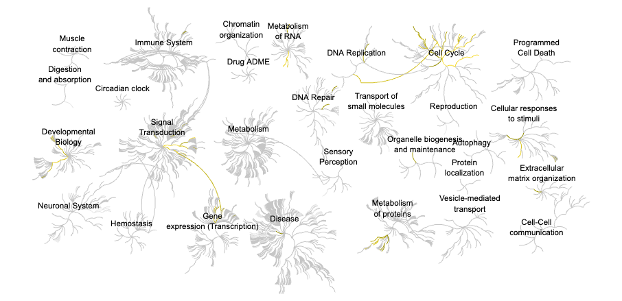

## Background

> Trapnell C, Hendrickson DG, Sauvageau M, Goff L et al. "Differential analysis of gene regulation at transcript resolution with RNA-seq". 

The authors report on differential analysis of lung fibroblasts in response to loss of the developmental transcription factor HOXA1. 

## Data Import
We have 2 key input files: counts and metadata.

```{r}
library(DESeq2)
metaFile <- "GSE37704_metadata.csv"
countFile <- "GSE37704_featurecounts.csv"
```

### Check and Tidy 

```{r}
# Import metadata and take a peek
colData <- read.csv(metaFile, row.names=1)
head(colData)
```
```{r}
# Import countdata
countData <-read.csv(countFile, row.names=1)
head(countData)
```
 
 >Q. Complete the code below to remove the troublesome first column from countData. 
 
 We need to remove the first "length" column from `countData` to have a 1:1 correspondance with `colData` rows. 
 
```{r}
countData <- as.matrix(countData[,-1])
head(countData)
```
 
## Setup for DESeq

> Q. Complete the code below to filter countData to exclude genes (i.e. rows) where we have 0 read count across all samples (i.e. columns).

```{r}
dds <- DESeqDataSetFromMatrix(countData = countData, 
                       colData = colData,
                       design = ~condition)
head(dds)
```

## Remove zero count genes 
Some genes (rows) have no count data (i.e. zero values). We should remove these before any further analysis. 

```{r}
rownames(colData) == colnames(countData)
```

### Run DESeq

```{r}
dds
```


### Get results 
```{r}
dds = DESeq(dds)
```
```{r}
res <- results(dds)
head(res)
```
### Save results 
```{r}
write.csv(res, file="results.csv")
```


## Volcano Plot 
```{r}
library(ggplot2)

mycols <- rep("gray", nrow(res))
mycols[res$log2FoldChange > 2] <- "blue"
mycols[res$log2FoldChange < -2] <- "blue"
mycols[res$padj >= 0.05 ] <- "gray"

ggplot(res) +
  aes(log2FoldChange, 
      -log(padj)) +
 geom_point(color=mycols) +
labs(x="Log2 Fold-Change", y="-log Adjusted P-value") +
geom_vline(xintercept = c(-2,2)) +
geom_hline(yintercept = -log(0.01))
```

## Add gene annotation 

```{r}
library("AnnotationDbi")
library("org.Hs.eg.db")
columns(org.Hs.eg.db)
```
### MapIds
```{r}
columns(org.Hs.eg.db)

res$symbol = mapIds(org.Hs.eg.db,
                    keys=row.names(res), 
                    keytype="ENSEMBL",
                    column="SYMBOL")

res$entrez = mapIds(org.Hs.eg.db,
                    keys=row.names(res),
                    keytype="ENSEMBL",
                    column="ENTREZID")

res$name =   mapIds(org.Hs.eg.db,
                    keys=row.names(res),
                    keytype="ENSEMBL",
                    column="GENENAME")

head(res, 10)
```
### Save annotated results 
```{r}
write.csv(res, file="results_annotated.csv")
```


## Pathway analysis

```{r, message=FALSE}
library(pathview)
library(gage)
library(gageData)
```

```{r}
data(kegg.sets.hs)
data(sigmet.idx.hs)

# Focus on signaling and metabolic pathways only
kegg.sets.hs = kegg.sets.hs[sigmet.idx.hs]
```

```{r}
# Examine the first 3 pathways
head(kegg.sets.hs, 3)
```

```{r}
foldchanges <- res$log2FoldChange
names(foldchanges) <- res$entrez
head(foldchanges)
```
```{r}
names(foldchanges) <- res$entrez
```
```{r}
keggres = gage(foldchanges, gsets=kegg.sets.hs)
attributes(keggres)
```
```{r}
head(keggres$less)
```
Cell cycle:
```{r}
pathview(gene.data=foldchanges, pathway.id="hsa04110")
```

DNA replication:
```{r}
pathview(gene.data=foldchanges, pathway.id="hsa03030")
```

RNA transport:
```{r}
pathview(gene.data=foldchanges, pathway.id="hsa03013")
```

Oocyte meiosis:
```{r}
pathview(gene.data=foldchanges, pathway.id="hsa04114")
```

Homologous recombination:
```{r}
pathview(gene.data=foldchanges, pathway.id="hsa03440")
```


## GO analysis

Focus on hte biological process BP section

```{r}
data(go.sets.hs)
data(go.subs.hs)

# Focus on Biological Process subset of GO
gobpsets = go.sets.hs[go.subs.hs$BP]

gobpres = gage(foldchanges, gsets=gobpsets)

lapply(gobpres, head)
```

## Reactome Analysis

We can use 

```{r}
sig_genes <- res[res$padj <= 0.05 & !is.na(res$padj), "symbol"]
print(paste("Total number of significant genes:", length(sig_genes)))
```
```{r}
write.table(sig_genes, file="significant_genes.txt", row.names=FALSE, col.names=FALSE, quote=FALSE)
```


>Q: What pathway has the most significant “Entities p-value”? Do the most significant pathways listed match your previous KEGG results? What factors could cause differences between the two methods?

Cell cycle, mitotic 

yes most significant pathways match previous results 


